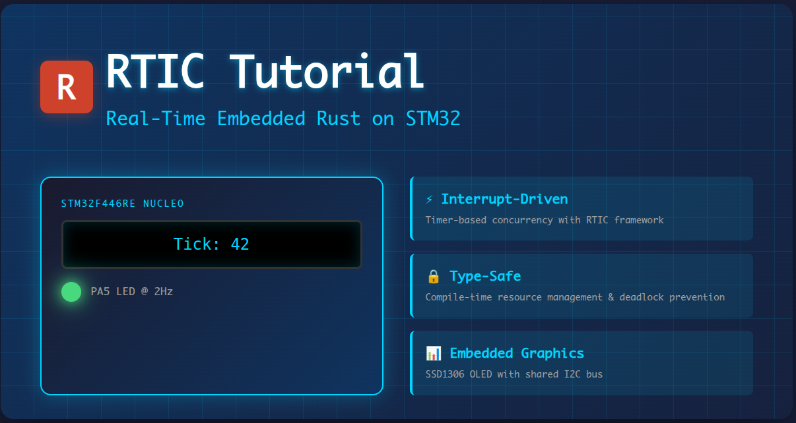
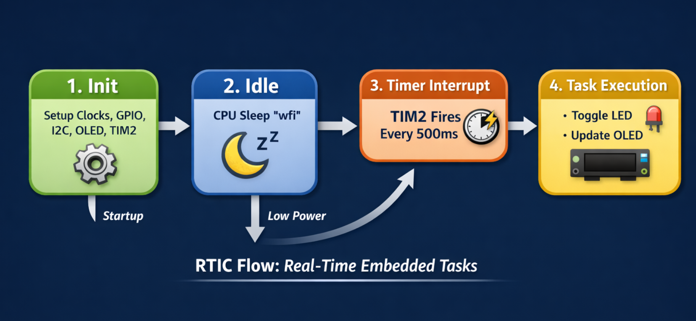

# RTIC OLED Bringup



A Real-Time Interrupt-driven Concurrency (RTIC) example demonstrating interrupt-driven LED blinking and OLED display updates on the STM32F446RE Nucleo board.

## Overview

This project introduces RTIC fundamentals through a practical example:

- **Timer-driven interrupts** using TIM2
- **Shared I2C bus** for OLED display using `shared-bus` crate
- **Type-safe concurrency** with RTIC's resource management
- **Embedded graphics** rendering with `embedded-graphics`

## Hardware Requirements

- **Board**: STM32 Nucleo-F446RE
- **MCU**: STM32F446RET6 (Cortex-M4F, 180 MHz, 512KB Flash, 128KB RAM)
- **Display**: SSD1306 OLED (128x32 or 128x64) via I2C
- **LED**: LD2 (Green) on PA5 (active-low)

### Connections

| Component | Pin  | Description                     |
| --------- | ---- | ------------------------------- |
| LED (LD2) | PA5  | On-board green LED (active-low) |
| I2C SCL   | PB8  | OLED clock line                 |
| I2C SDA   | PB9  | OLED data line                  |
| I2C VCC   | 3.3V | OLED power                      |
| I2C GND   | GND  | OLED ground                     |

**Note**: OLED I2C address is typically `0x3C`. Verify with an I2C scanner if you have connection issues.

## Features



### RTIC Concepts Demonstrated

1. **Tasks and Interrupts**

   - Hardware interrupt handler (`TIM2`) bound to RTIC task
   - Efficient event-driven execution (no polling loops)

2. **Resource Management**

   - **Local resources**: Exclusive access within a single task
   - **Shared resources**: Safe concurrent access between tasks
   - Compile-time deadlock prevention

3. **Static Scheduling**

   - Zero-cost abstractions
   - Predictable timing and latency
   - No dynamic memory allocation

4. **Idle Loop**
   - Low-power sleep mode using `wfi` (Wait For Interrupt)
   - CPU only wakes for interrupts

### What It Does

- Blinks the on-board LED at 2 Hz (500ms period)
- Updates OLED display with tick counter on each interrupt
- Prints debug messages via defmt/RTT
- Runs entirely interrupt-driven (no busy loops)

## Building and Flashing

### Prerequisites

```bash
# Install Rust and embedded tools
rustup target add thumbv7em-none-eabihf
cargo install probe-rs --features cli
```

### Build

```bash
cargo build --release
```

### Flash and Run

```bash
cargo run --release
```

Or using probe-rs directly:

```bash
probe-rs run --chip STM32F446RETx target/thumbv7em-none-eabihf/release/rtic_oled_bringup
```

### Debugging with RTT

The project uses `defmt` for efficient logging over RTT (Real-Time Transfer):

```bash
# Terminal 1: Start RTT server
probe-rs run --chip STM32F446RETx target/thumbv7em-none-eabihf/release/rtic_oled_bringup

# You'll see output like:
# Starting init...
# System initialized at 48 MHz
# LED should be ON now (active-low)
# Init complete, entering main loop
# Timer interrupt #1
# Timer interrupt #2
# ...
```

## Code Structure

### Main Components

```
src/main.rs
├── Type Aliases (I2C bus, display interface)
├── #[app] Module
│   ├── Shared Resources (currently empty)
│   ├── Local Resources (led, timer, display, etc.)
│   ├── #[init] - Hardware initialization
│   ├── #[task] tim2_handler - Timer interrupt handler
│   └── #[idle] - Low-power idle loop
```

### Initialization Flow

1. **Clock Setup**: 8 MHz HSE → 48 MHz SYSCLK
2. **GPIO**: Configure PA5 (LED), PB8/PB9 (I2C)
3. **I2C**: Initialize at 400 kHz (Fast Mode)
4. **Shared Bus**: Create thread-safe I2C bus manager
5. **OLED**: Initialize SSD1306 display
6. **Timer**: Configure TIM2 for 2 Hz interrupts

### Task Execution

```
Timer Interrupt (TIM2) every 500ms
    ↓
tim2_handler() executes
    ↓
├─ Clear interrupt flag
├─ Toggle LED (PA5)
├─ Increment counter
├─ Clear OLED display
├─ Render new text with counter
└─ Flush to display
    ↓
Return to idle (wfi)
```

## Key Libraries

| Crate               | Version | Purpose                                          |
| ------------------- | ------- | ------------------------------------------------ |
| `rtic`              | 2.1     | Real-Time Interrupt-driven Concurrency framework |
| `stm32f4xx-hal`     | 0.21    | Hardware Abstraction Layer for STM32F4           |
| `ssd1306`           | 0.8     | OLED display driver                              |
| `embedded-graphics` | 0.8     | 2D graphics library                              |
| `shared-bus`        | 0.3     | Thread-safe peripheral sharing                   |
| `heapless`          | 0.8     | Static data structures (no heap)                 |
| `defmt`             | 0.3     | Efficient logging framework                      |

## Memory Usage

- **Flash**: ~8-10 KB (of 512 KB available)
- **RAM**: ~2-3 KB (includes OLED framebuffer)
- **Stack**: Configured in `memory.x` (typically 8-16 KB)

## Configuration Options

### Changing Timer Frequency

In `init()`:

```rust
timer.start(2_u32.Hz()).unwrap();  // 2 Hz = 500ms period
```

Options:

- `1_u32.Hz()` - 1 second period
- `10_u32.Hz()` - 100ms period
- `1000_u32.Hz()` - 1ms period (1 kHz)

### Changing OLED Display Size

If you have a 128x64 display:

```rust
// In Local struct:
display: Ssd1306<I2CInterface<I2cProxy>, DisplaySize128x64, BufferedGraphicsMode<DisplaySize128x64>>,

// In init():
let mut display = Ssd1306::new(interface, DisplaySize128x64, DisplayRotation::Rotate0)
```

### Changing System Clock

In `init()`:

```rust
let clocks = rcc.cfgr
    .use_hse(8.MHz())
    .sysclk(84.MHz())  // Up to 180 MHz supported
    .freeze();
```

**Note**: Higher frequencies increase power consumption but provide more processing headroom.

## Troubleshooting

### OLED Not Displaying

1. **Check I2C address**: Default is `0x3C`, some displays use `0x3D`

   ```rust
   let interface = I2CInterface::new(bus.acquire_i2c(), 0x3D, 0x40);  // Try 0x3D
   ```

2. **Check display size**: Ensure `DisplaySize128x32` matches your hardware

3. **Check wiring**: Verify VCC, GND, SCL, SDA connections

4. **Check pull-ups**: I2C requires pull-up resistors (many OLED modules have them built-in)

### LED Not Blinking

1. **Verify pin**: Nucleo-F446RE uses PA5 (not PD12 like Discovery boards)
2. **Check active-low**: LED turns on with `set_low()`, off with `set_high()`
3. **Verify clock**: Ensure HSE is working (check debug output)

### Compilation Errors

See `NOTES.md` for common issues and solutions.

## Next Steps

### Adding More Features

1. **Button Input** (PC13 - Blue button):

   ```rust
   // Add to Local resources
   button: Pin<'C', 13, Input>,

   // In init:
   let gpioc = dp.GPIOC.split();
   let button = gpioc.pc13.into_pull_up_input();

   // In task:
   if cx.local.button.is_low() {
       // Button pressed
   }
   ```

2. **Multiple Timers**:

   ```rust
   #[task(binds = TIM3, local = [timer3])]
   fn tim3_handler(cx: tim3_handler::Context) {
       // Different timing task
   }
   ```

3. **LoRa Module Integration** (Coming next!):
   - SPI communication
   - Interrupt-driven packet reception
   - Shared SPI bus management

## Learning Resources

- [RTIC Book](https://rtic.rs) - Official documentation
- [STM32F4 HAL Docs](https://docs.rs/stm32f4xx-hal) - Hardware abstraction layer
- [Embedded Graphics Book](https://docs.rs/embedded-graphics) - Graphics library
- [The Embedded Rust Book](https://docs.rust-embedded.org/book/) - General embedded Rust

## License

This is example/tutorial code for learning purposes.

## Author

- Antony Mapfumo https://www.mapfumo.net

Created as part of a 4-month embedded systems learning plan.
